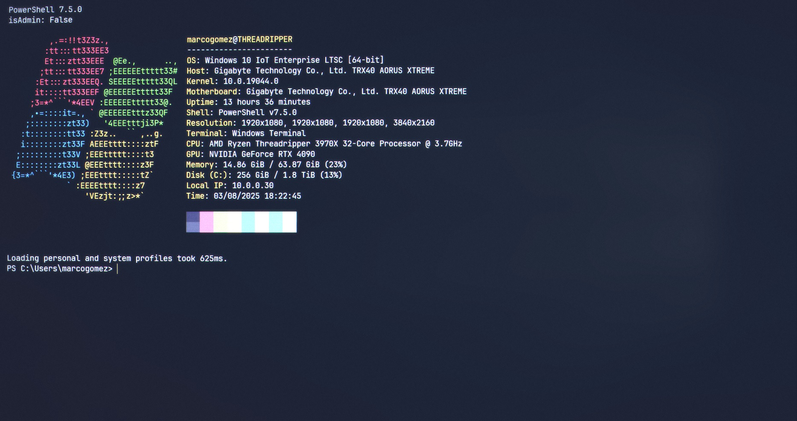
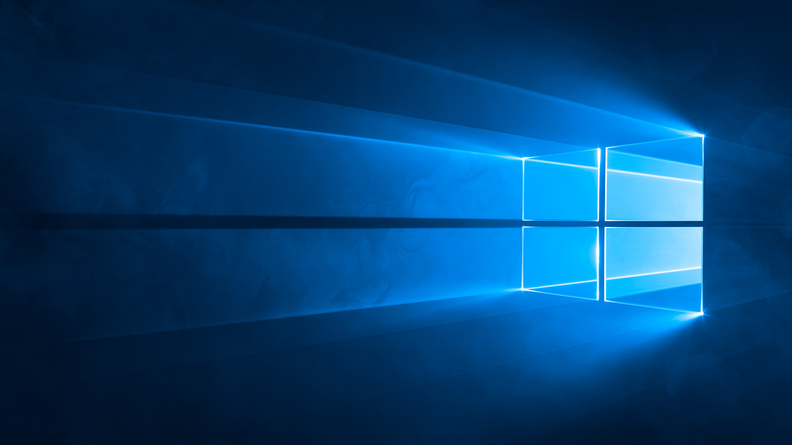

# WinDotfiles



## My personal Windows dotfiles.

Written to be used on Windows 10 Enterprise LTSC 2021... because **fuck Microsoft** with its bloat, ads, and abusive data mining on a fucking **PAID operating system**. We're not idiots, nor products.

You should NEVER pay for an operating system showing ads on a weather widget, nor allow it to collect your data or freely push new software you haven't asked for to your computer.

The only reason to use Windows is when you develop software for Windows users (*unfortunately, the vast majority of desktop users*), and if you're forced to do so, you should at least hack it to do it decently.

## Installing **`winget`** without the stupid Microsoft Store

### Download the necessary dependencies:

You'll need to get a few files to install `winget` on Windows 10 LTSC 2021 without relying on installing the stupid Microsoft store. The files you'll need are:

`Microsoft.VCLibs.140.00.UWPDesktop_14.0.33728.0_x64__8wekyb3d8bbwe.Appx`

`Microsoft.UI.Xaml.2.8_8.2501.31001.0_x64__8wekyb3d8bbwe.Appx`

`Microsoft.DesktopAppInstaller_2025.228.315.0_neutral_~_8wekyb3d8bbwe.Msixbundle`

These files can be obtained by copying the following URL:

```
https://www.microsoft.com/en-us/p/app-installer/9nblggh4nns1
```

... and pasting it in the form present in this website: [https://store.rg-adguard.net/](https://store.rg-adguard.net/)

Once you entered the first URL in the form, and clicked the button of the form, you'll see a list of files. Press `Ctrl+f` to search on the page, and type `x64` on the search box to easily spot the 64-bits versions you'll need. Then download the necessary files.

> Note: The download links are a bit buggy, so `right-click` the file you want, click on `open in new window`, and refresh the new window with `F5` to download the file. Repeat the same for all needed files.

### Installing the downloaded dependencies:

You can now install all the downloaded files by issuing the following commands on an **elevated** (open as Administrator) PowerShell terminal:

```powershell
Add-AppxPackage "C:\Users\<your_username>\win10\Microsoft.VCLibs.140.00.UWPDesktop_14.0.33728.0_x64__8wekyb3d8bbwe.Appx"
```

```powershell
Add-AppxPackage "C:\Users\marcogomez\win10\Microsoft.UI.Xaml.2.8_8.2501.31001.0_x64__8wekyb3d8bbwe.Appx"
```

```powershell
Add-AppxPackage "C:\Users\marcogomez\win10\Microsoft.DesktopAppInstaller_2025.228.315.0_neutral_~_8wekyb3d8bbwe.Msixbundle"
```

> Note: Please keep in mind that the installer is a buggy mess, and it may take about 10 seconds for `winget` to get into the path environment variable and become a usable command.

Once you waited for 10 seconds, you can verify if `winget` is ready to be used with the following command:

```powershell
Get-Command winget
```

If it is still not present, you may try closing your terminal and re-opening it or restarting your machine (you're using Windows; I'm sorry, but that's how things are in these God-forsaken lands).

Once you get `winget` up and running, you can install software using it, with commands like:

Windows terminal:
```powershell
winget install --accept-source-agreements --silent --exact --id "Microsoft.WindowsTerminal"
```

PowerShell 7.5:
```powershell
winget install --accept-source-agreements --silent --exact --id "Microsoft.PowerShell"
```

You may also use [Chocolatey](https://chocolatey.org/install) or [Scoop](https://scoop.sh/) as your main command-line installers for Windows.



### Have fun!
